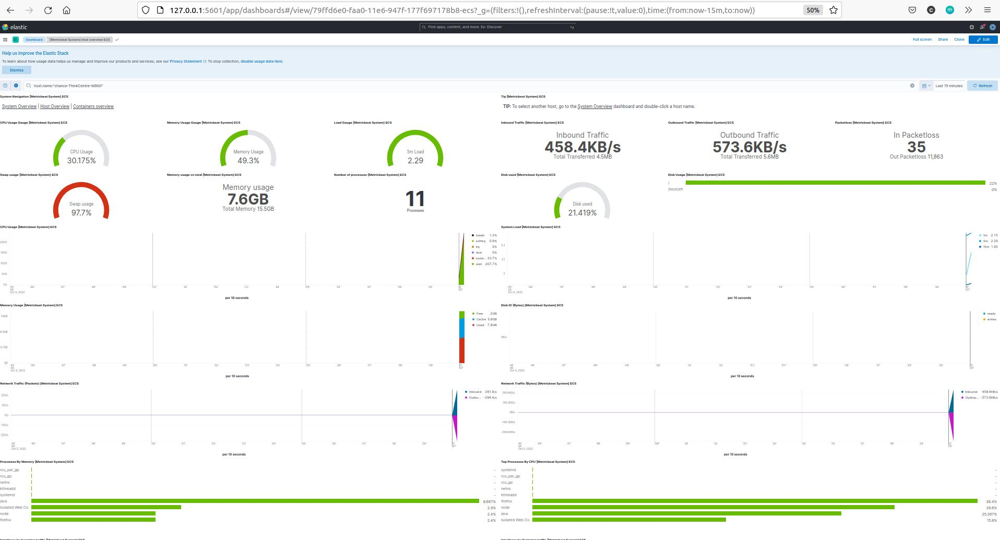
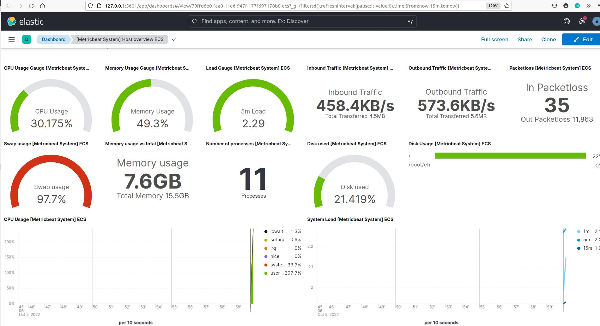

# Project Name: ELK Monitoring
This instruction shows how to setup a ELK (Elasticsearch/Logstash/Kibana) stack to monitor a server.

# Project Goal
Learn how to deploy a ELK with docker-compose, as well as configuring metricbeat service to collect the system metric from a server and present them in Kibana.

# Table of Contents
1. [Prerequisites](#prerequisites)
2. [Project Steps](#project_steps)
3. [Post Project](#post_project)
4. [Troubleshooting](#troubleshooting)
5. [Reference](#reference)


# <a name="prerequisites">Prerequisites</a>
- Ubuntu 20.04 OS
- [Docker](https://docs.docker.com/engine/install/ubuntu/)
- [Docker Compose](https://docs.docker.com/compose/install/)

# <a name="project_steps">Project Steps</a>
## 1. Deploy a ELK stack
Clone the github repo and run the docker compose to start up the ELK stack
```
git clone https://github.com/chance2021/devopsdaydayup.git
cd devopsdaydayup/001-ELKMonitoring
sudo sysctl -w vm.max_map_count=262144

# remember to update password in .env file

sudo docker-compose up -d
```

## 2. Add Elasticsearch CA certificates
As the communication between Elasticsearch and metricbeat is using tls, you need to add the Elasticsearch CA into the server which is going to be monitored.

a. Copy the CA certificate from one of Elasticsearch containers
```
docker exec -it <elasticsearch 01> openssl x509 -fingerprint -sha256 -in /usr/share/elasticsearch/config/certs/ca/ca.crt
```

b.  Go to the host which you want to monitor and run below command:
```
sudo apt-get install -y ca-certificates
cd /usr/local/share/ca-certificates/
sudo vi elasticsearch-ca.crt
# Paste the CA certificate you copied in above step and then run below command to add it to the host
sudo update-ca-certificates
```

## 3. Deploy metricbeat service 
Deploy a metricbeat service in the monitored server to collect the metric data.
> Note: In this example, we are monitoring the local host. For other hosts, you just need to update the ELK host IP address in the `metricbeat.yaml` to make sure the metricbeat can reach the Elasticsearch.
```
wget -qO - https://artifacts.elastic.co/GPG-KEY-elasticsearch | sudo apt-key add -
echo "deb https://artifacts.elastic.co/packages/7.x/apt stable main" | sudo tee -a /etc/apt/sources.list.d/elastic-7.x.list
sudo apt update
sudo apt install metricbeat
sudo vim /etc/metricbeat/metricbeat.yml
# Note: Make sure below section is updated in `metricbeat.yml`
setup.kibana:
  host: "127.0.0.1:5601"
output.elasticsearch:
  hosts: ["127.0.0.1:9200"]
  protocol: "https"
  username: "elastic"
  password: "changeme"

sudo metricbeat setup -e

# if you are in wsl use following command
# sudo service metricbeat start
# sudo service metricbeat status
sudo systemctl start metricbeat
sudo systemctl status metricbeat
```


## 4. Go to Kibana. In Dashboard, select "[Metricbeat System] Host overview ECS"

a. Open your browser and go to [http://0.0.0.0:5601/](http://0.0.0.0:5601/) (if the metricbeat is installed in your local host). Enter the username(default is elastic)/passwors set in `.env`.

b. Click the menu icon in the top left and go to "Dashboard"

c. Select "[Metricbeat System] Host overview ECS" and you should be able to see all metric data from your local host presented in the dashboard.



# <a name="post_project">Post Project</a>
Run below commands to remove docker containers and volumes
```
docker-compose down -v
sudo systemctl stop metricbeat
sudo systemctl disable metricbeat
sudo apt remove metricbeat
```
# <a name="troubleshooting">Troubleshooting</a>

# <a name="reference">Reference</a>
https://www.elastic.co/guide/en/elasticsearch/reference/current/docker.html

https://kifarunix.com/monitor-linux-system-metrics-with-elk-stack/

https://github.com/elastic/beats/issues/29175

https://www.elastic.co/training/free
