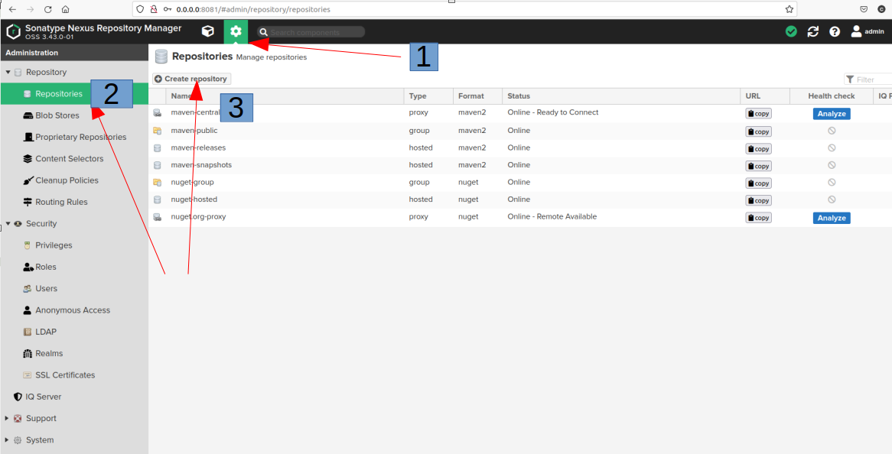
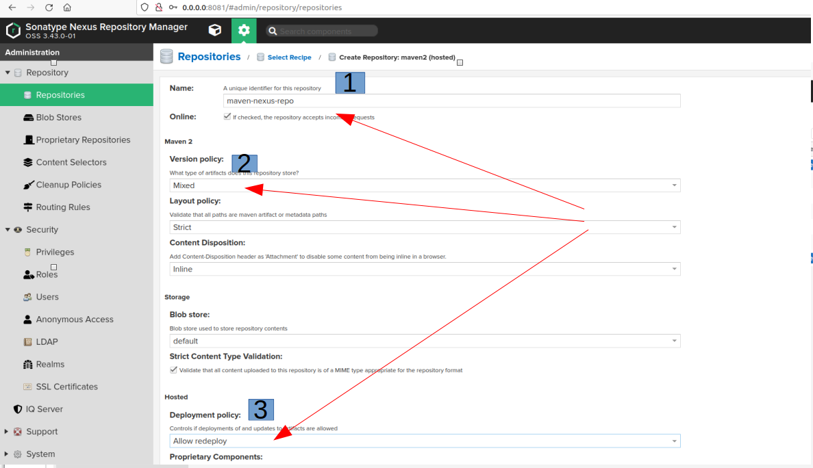
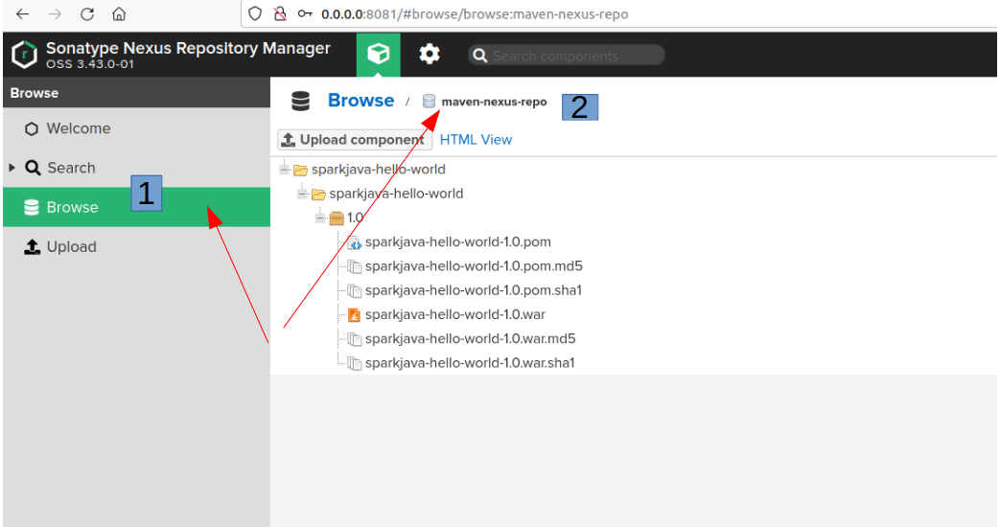
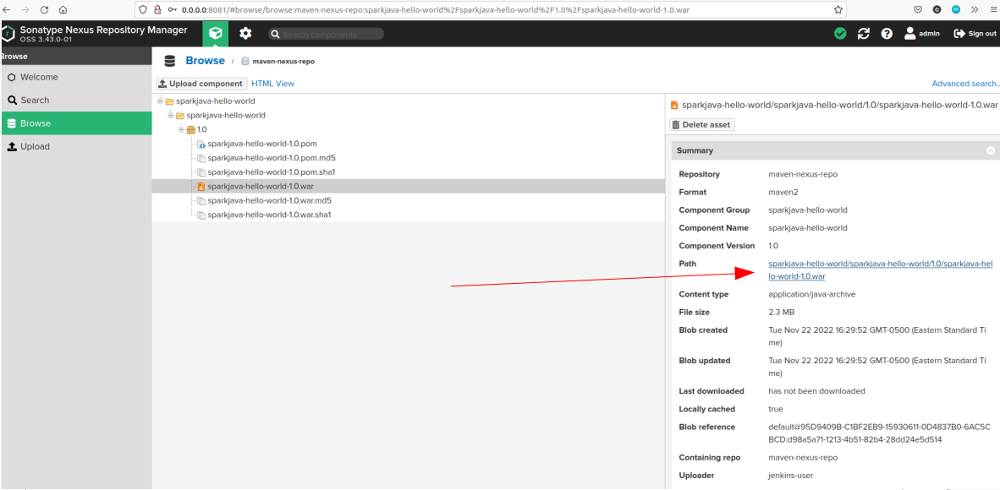
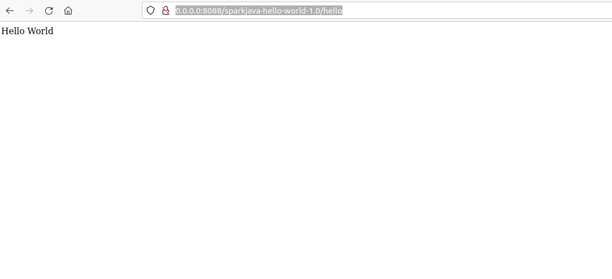

# Project Name: Push War file to Nexus Repository Via Jenkins Pipeline and Deploy to Tomcat in Vagrant VM

# Project Goal
In this article, you will set up a **Nexus** repository and push a war file from **Jenkins Pipeline**, then you will deploy the war file to a **Tomcat 9** installed in a **Vagrant VM**

# Table of Contents
1. [Prerequisites](#prerequisites)
2. [Project Steps](#project_steps)
3. [Post Project](#post_project)
4. [Troubleshooting](#troubleshooting)
5. [Reference](#reference)

# <a name="prerequisites">Prerequisites</a>
- Ubuntu 20.04 OS (Minimum 2 core CPU/8GB RAM/30GB Disk)
- Docker(see installation guide [here](https://docs.docker.com/get-docker/))
- Docker Compose(see installation guide [here](https://docs.docker.com/compose/install/))
- Vagrant(see download page [here](https://developer.hashicorp.com/vagrant/downloads))
- VBox (see installation guide [here](https://www.virtualbox.org/wiki/Linux_Downloads))

# <a name="project_steps">Project Steps</a>

## 1. Deploy Jenins and Nexus containers
```
docker-compose build
docker-compose up -d
```

## 2. Configure Nexus
a. Open a browser and **login to** Nexus home page (http://0.0.0.0:8081)</br>
b. Fetch the **password** for `admin` user</br>
```
docker exec $(docker ps --filter name=nexus_1 -q) cat /nexus-data/admin.password
```
c. Click **"Sign In"** in the top right and type username `admin`, as well as the password fetched in the previous step</br>
d. Follow the **wizard** and reset your password. Select **"Enable anonymous access"** and click **"Next"**->**"Finish"** to complete the guide.</br>
e. Click **Gear icon** in the top and click **"Repositories"** in **"Repository"** section. Click **"Create repository"** to create a new repo.</br>

f. Select **"maven2(hosted)"** and fill below fields as instructed: </br>
**Name:** `maven-nexus-repo`</br>
**Version policy:** Mixed</br>
**Deployment policy:** Allow redeploy</br>

Click **"Create repository"** in the bottom</br>
g. To create a new user, go to **"Security"** -> **"Users"** -> Click **"Create local user"** and fill below fields as instructed: </br>
**ID:** `jenkins-user` </br>
**First name:** Jenkins</br>
**Last name:** User</br>
**Email:** jenkins.user@gmail.com</br>
**Password:**  *(Type your password)* </br>
**Confirm password:**  *(Type the same password you entered above)*  </br>
**Status:** Active</br>
**Roles:** nx-admin</br> 

## 3. Configure Jenkins
a. Login to your Jenkins website (http://0.0.0.0:8080) and go to **"Manage Jenkins"** -> **"Manage Credentials"** ->  **"System"** -> **"Global credentials (unrestricted)"** -> Click **"Add Credentials"** and you should fill out the page in below selection: </br>
> Note: The **username** and **password** is in `.env` file </br>

**Kind:** Username with password</br>
**Scope:** Global(Jenkins, nodes, items, all child items, etc)</br>
**Username:** jenkins-user</br>
**Password:** *(Type the password you set in previous step)*</br>
**ID:** nexus</br>
**Description:** nexus credential</br>
b. To create a new pipeline, go back to Dashboard, click **"New Item"** in the left navigation lane, and type the item name (i.g. `first-project`) and select **"Pipeline"**. Click **"OK"** to configure the pipeline.</br>
c. Go to **"Pipeline"** section and select **"Pipeline script from SCM"** in the **"Definition"** field</br>
d. Select **"Git"** in **"SCM"** field</br>
e. Add `https://github.com/chance2021/devopsdaydayup.git` in **"Repository URL"** field</br>
f. Select your github credential in **"Credentials"**</br>
g. Type `*/main` in **"Branch Specifier"** field</br>
h. Type `006-NexusJenkinsVagrantCICD/Jenkinsfile` in **"Script Path"**</br>
i. Unselect **"Lightweight checkout"** and click "Apply" to complete the creation</br>
j. To add maven tool, go back to **"Dashboard"** -> **"Manage Jenkins"** -> **"Global Tool Configuration"** -> Scroll down to **"Maven"** section and click **"Add Maven"**. Then fill out below fields as instructed:</br>
**Name:** m3</br>
**Install automaticall** selected</br>
**Version:** 3.8.6</br>
Click **"Save"**</br>

## 4. Launch the Jenkins pipeline
Go to **"Dashboard"** -> Click **"first-project"** pipeline -> Click **"Build Now"**, then the Jenkins pipeline will compile the app to a war file and upload to the Nexus repository. </br>
You can login to the Nexus website (http://0.0.0.0:8081) and go to **"Browse"** section, and then click **"maven-nexus-repo"**, you should be able to see the artifacts just uploaded.


## 5. Deploy a Tomcat server via Vagrant
Run below command to start up a Vagrant VM:
```
vagrant up
```

## 6. Download the war file and deploy to the Tomcat server
Once the deployment is done, you can login to the Tomcat Vagrant VM and download the war from the Nexus repo. You should be able to see the url link to download the war file in the Nexus web page. Just make sure to replace the IP address `0.0.0.0` to the actual IP of your host (running `ifconfig` to check your host IP).

```
vagrant ssh
cd /var/lib/tomcat9/webapp/
sudo wget http://<your_host_IP>:8081/repository/maven-nexus-repo/sparkjava-hello-world/sparkjava-hello-world/1.0/sparkjava-hello-world-1.0.war 
```
Wait for **2 mins** and then you can see the war file is unzip
```
vagrant@vagrant:/var/lib/tomcat9/webapps$ ls
ROOT  sparkjava-hello-world-1.0  sparkjava-hello-world-1.0.war
```
Then type `exit` to exit the Vagrant VM and type below URL in yoru browser, and you should be able to see the "Hello World" page
```
http://0.0.0.0:8088/sparkjava-hello-world-1.0/hello
```


# <a name="post_project">Post Project</a>
Stop/Remove the Jenkins/Nexus containers
```
docker-compose down -v
```
Stop/Remove the Vagrant VM
```
vagrant destroy
```

# <a name="troubleshooting">Troubleshooting</a>
## Issue 1: Fail to maven build
Below error occurs when running `mvn package -DskipTests=true`:
```
[ERROR] Failed to execute goal on project cargo-tracker: Could not resolve dependencies for project net.java:cargo-tracker:war:1.0-SNAPSHOT: Failed to collect dependencies at org.glassfish.jersey.media:jersey-media-moxy:jar:2.0 -> org.eclipse.persistence:org.eclipse.persistence.moxy:jar:2.5.0-M13: Failed to read artifact descriptor for org.eclipse.persistence:org.eclipse.persistence.moxy:jar:2.5.0-M13: Could not transfer artifact org.eclipse.persistence:org.eclipse.persistence.moxy:pom:2.5.0-M13 from/to maven-default-http-blocker (http://0.0.0.0/): Blocked mirror for repositories: [primefaces (http://repository.primefaces.org, default, releases+snapshots), eclipselink.repository (http://download.eclipse.org/rt/eclipselink/maven.repo, default, releases+snapshots)] -> [Help 1]
```
**Solution:**
Change Maven version to 3.3.9 in Jenkins

## Issue 2: Failed to execute goal org.apache.maven.plugins:maven-war-plugin:2.2:war (default-war) on project my-app

**Solution:**

ref: https://stackoverflow.com/questions/33390460/maven-error-assembling-war-webxml-attribute-is-required-when-building-the-sprin

## Issue 3: Stderr: VBoxManage: error: VT-x is disabled in the BIOS for all CPU modes (VERR_VMX_MSR_ALL_VMX_DISABLED)
When running `vagrant up`, see below error:
```
here was an error while executing `VBoxManage`, a CLI used by Vagrant
for controlling VirtualBox. The command and stderr is shown below.

Command: ["startvm", "a37a5fa4-0d58-460e-96f2-e6336c12ad2e", "--type", "headless"]

Stderr: VBoxManage: error: VT-x is disabled in the BIOS for all CPU modes (VERR_VMX_MSR_ALL_VMX_DISABLED)
VBoxManage: error: Details: code NS_ERROR_FAILURE (0x80004005), component ConsoleWrap, interface IConsole

```
**Solution:**
https://www.howtogeek.com/213795/how-to-enable-intel-vt-x-in-your-computers-bios-or-uefi-firmware/
# <a name="reference">Reference</a>
[Integrating Ansible Jenkins CICD Process](https://www.redhat.com/en/blog/integrating-ansible-jenkins-cicd-process) </br>

[Maven In Five Minutes](https://maven.apache.org/guides/getting-started/maven-in-five-minutes.html)</br>
[Publishing Artifacts to Sonatype Nexus Using Jenkins](https://dzone.com/articles/publishing-artifacts-to-sonatype-nexus-using-jenki)</br>
[Maven Crash Course](https://www.marcobehler.com/guides/mvn-clean-install-a-short-guide-to-maven#_a_look_at_the_maven_build_lifecycle_phases)</br>
[How to Upload Artifact to Nexus using Jenkins](https://www.fosstechnix.com/how-to-upload-artifact-to-nexus-using-jenkins/)</br>
[Vagrant Cheat Sheet](https://gist.github.com/wpscholar/a49594e2e2b918f4d0c4)</br>
[Install Tomcat](https://linuxhint.com/install_apache_tomcat_server_ubuntu/)
