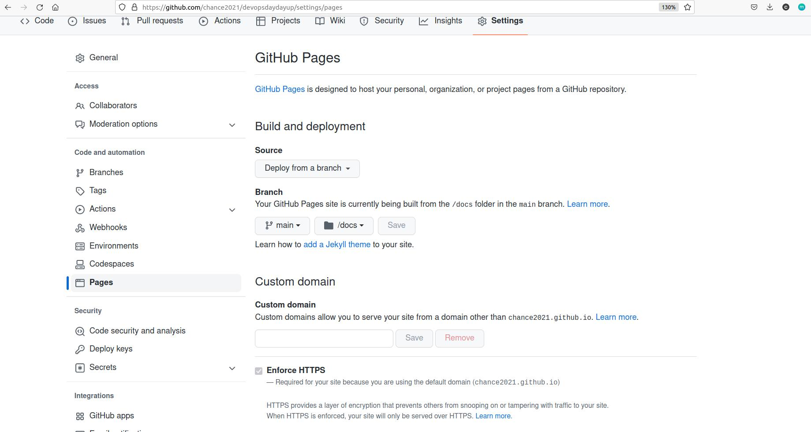

# Project Name: Helm Deployment in K8s 

# Project Goal
In this article, you will learn how to deploy a Jenkins via Helm Chart in K8s

# Table of Contents
1. [Prerequisites](#prerequisites)
2. [Project Steps](#project_steps)
3. [Post Project](#post_project)
4. [Troubleshooting](#troubleshooting)
5. [Reference](#reference)

# <a name="prerequisites">Prerequisites</a>
- Ubuntu 20.04 OS (Minimum 2 core CPU/8GB RAM/30GB Disk)
- Docker(see installation guide [here](https://docs.docker.com/get-docker/))
- Docker Compose(see installation guide [here](https://docs.docker.com/compose/install/))
- Minikube (see installation guide [here](https://minikube.sigs.k8s.io/docs/start/))
- Helm (see installation guide [here](https://helm.sh/docs/intro/install/)

# <a name="project_steps">Project Steps</a>

## 1. Start Minikube
You can install the **Minikube** by following the instruction in the [Minikube official website](https://minikube.sigs.k8s.io/docs/start/). Once it is installed, start the minikube by running below command:
```
minikube start
minikube status
```
Once the Minikube starts, you can download the **kubectl** from [k8s official website](https://kubernetes.io/docs/tasks/tools/)
```
minikube kubectl
alias k="kubectl"
```
Then, when you run the command `kubectl get node` or `k get node`, you should see below output:
```
NAME       STATUS   ROLES           AGE     VERSION
minikube   Ready    control-plane   4m37s   v1.25.3
```
## 2. Enable Minikube Dashboard
You can also enable your **Minikube dashboard** by running below command:
```
minikube dashboard
```
You should see a Kuberentes Dashboard page pop out in your browser immediately. You can explore all Minikube resources in this UI website.

## 3. Install Helm v3.x
Run the following commands to install **Helm v3.x**:
> ref: https://helm.sh/docs/intro/install/
```
curl https://raw.githubusercontent.com/kubernetes/helm/master/scripts/get-helm-3 > get_helm.sh
chmod 700 get_helm.sh
./get_helm.sh
```

## 4. Add Helm Repo
Once Helm is set up properly, **add** the **repo** as follows:
```
helm repo add jenkins https://charts.jenkins.io
helm repo update
```

## 5. Install Jenkins Helm Chart
Helm uses a packaging format called **charts**. A **chart** is a collection of files that describe a related set of Kubernetes resources, such as deployment, statefulset, secret, configmap, etc.. We are going to download/install the chart from the **jenkins** repo:

```
helm install jenkins jenkins/jenkins 
```
You can check the logs by running below command:
```
minikube logs
```

## 6. Access Jenkins Website
Now, you have deployed a Jenkins service in the Minikube. You can check if the Jenkins pod is in `Running` state
```
k get pod
```
If so, **forward** the port to your local and then you can access the Jenkins website
```
kubectl --namespace default port-forward svc/jenkins 8080:8080
```
Open your **browser** and type `http://0.0.0.0:8080`
> Note: You can retrieve the password by running following command. The username is `admin`.
```
kubectl exec --namespace default -it svc/jenkins -c jenkins -- /bin/cat /run/secrets/additional/chart-admin-password && echo
```
---
# Create Your Own Helm Chart
In above lab, we went through the steps to deploy an app via Helm Chart in K8s. In practical, you may need to create your own helm chart to deploy your own developed code.In the following article, we will create a **customized helm chart** and store it in the **GitHub page**.
## 1. Create your own Github repo.
You can refer to [here](https://docs.github.com/en/get-started/quickstart/create-a-repo) for how to **create a repo** in the Github.
## 2. Create a Helm Chart
In your repo created above, run below commands to **create a Helm Chart**
```
mkdir helm-charts
cd helm-charts
helm create test-service
```
Then you will see a folder `test-service` is created. Below is the structure in the folder
```
$ tree test-service/
test-service/
├── charts
├── Chart.yaml
├── templates
│   ├── deployment.yaml
│   ├── _helpers.tpl
│   ├── hpa.yaml
│   ├── ingress.yaml
│   ├── NOTES.txt
│   ├── serviceaccount.yaml
│   ├── service.yaml
│   └── tests
│       └── test-connection.yaml
└── values.yaml

```
**charts:** Charts that this chart depends on. You can define the **dependencies** in `Chart.yaml`</br>
**Chart.yaml:** Information about your chart</br>
**templates:** All template manifest files</br>
**values.yaml:** The default values for your templates</br>
You can modify this Helm Chart files as you need.
## 3. Package and upload your Helm Chart
You need to package your Helm Chart into `tgz` file and upload to the Github.
```
helm package test-service
```
The `tgz` file should be generated
```
$ ls
test-service  test-service-0.1.0.tgz
```
Create the `index.yaml` file
```
helm repo index --url https://<your_github_account>.github.io/<repo_name> ./

# i.g.
helm repo index --url https://chance2021.github.io/devopsdaydayup ./
$ ls
index.yaml  test-service  test-service-0.1.0.tgz
```
Create a `docs` in the root directory and move both `index.yaml` and `test-service-0.1.0.tgz` into it
```
cd ..
mkdir docs
mv helm-charts/{index.yaml,test-service-0.1.0.tgz} docs
```
**Commit** the changes to your Github repo
```
git add .
git commit -m "Helm Chart"
git push
```
## 4. Create Github Pages
In order to make your `tgz` downloadable from your Github site, you need to enable your Github Pages. </br>
a. Go to your Github site and head into **your repo** which is planning to be used to hold your Helm Chart.</br>
b. Go to **"Settings"** and click "Pages" in the left lane. </br>
c. In the **Branch** section, select "main" and "/docs". </br>
d. Click "Save" to apply the change. </br>
Once the Github Page is setup, you should be able to download the `tgz` file from the site. The URL should be like `https://<your_github_username>.github.io/<your_repo_name>`


## 5. Deploy your own Helm Chart
Now you are ready to deploy your own created Helm Chart! </br>
**Add the Helm repository** locally
```
helm repo add myrepo https://<your_github_username>.github.io/<your_repo_name>

# i.g.
$ helm repo add myrepo https://chance2021.github.io/devopsdaydayup
"myrepo" has been added to your repositories
```
**Install** this Helm Chart into your Minikube
```
helm install test-service myrepo/test-service
```
You should see below **output** once the deployment is successful
```
NAME: test-service
LAST DEPLOYED: Sat Dec 10 19:52:20 2022
NAMESPACE: default
STATUS: deployed
REVISION: 1
NOTES:
1. Get the application URL by running these commands:
  export POD_NAME=$(kubectl get pods --namespace default -l "app.kubernetes.io/name=test-service,app.kubernetes.io/instance=test-service" -o jsonpath="{.items[0].metadata.name}")
  export CONTAINER_PORT=$(kubectl get pod --namespace default $POD_NAME -o jsonpath="{.spec.containers[0].ports[0].containerPort}")
  echo "Visit http://127.0.0.1:8080 to use your application"
  kubectl --namespace default port-forward $POD_NAME 8080:$CONTAINER_PORT

```

# <a name="post_project">Post Project</a>
Delete Minikube
```
minikube delete
```

# <a name="troubleshooting">Troubleshooting</a>

# <a name="reference">Reference</a>
[Bitnami Get Started with Bitnami Charts using Minikube](https://docs.bitnami.com/kubernetes/get-started-kubernetes/)</br>
[Jenkins Helm Chart](https://artifacthub.io/packages/helm/jenkinsci/jenkins)</br>
[Jenkins Configuration As Code Plugin](https://github.com/jenkinsci/configuration-as-code-plugin/tree/master/demos)</br>
[Running Jenkins on Kubernetes](https://cloud.google.com/solutions/jenkins-on-container-engine)</br>
[Jenkins Configuration as Code](https://jenkins.io/projects/jcasc/)</br>
[Create a Public Helm Charte Repository](https://medium.com/@mattiaperi/create-a-public-helm-chart-repository-with-github-pages-49b180dbb417)
[Create a Public Helm Charte Repository 2](https://www.opcito.com/blogs/creating-helm-repository-using-github-pages)
