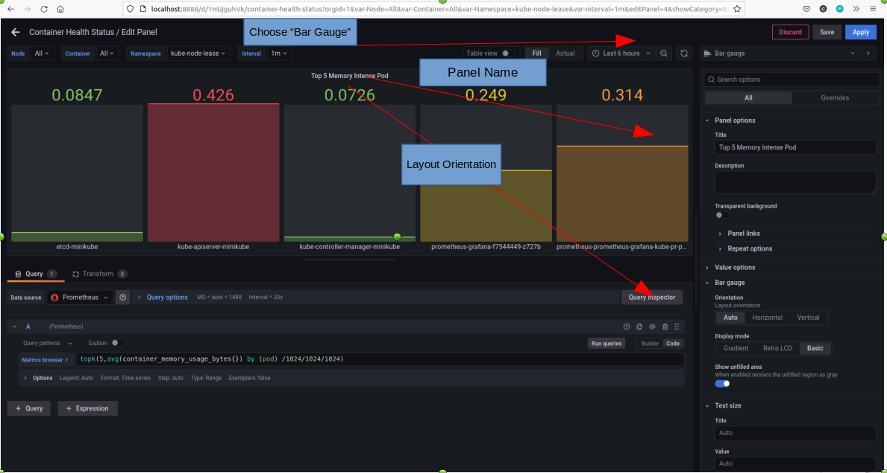

# Project Name: Deploy Prometheus/Grafana on Minikube and Monitor Containers' Health

## Project Goal
In this lab, we will deploy the **Prometheus-Grafana** **Helm** chart on **Minikube**, and then set up a **dashboard** to monitor the health of the containers in the Minikube cluster.

## Table of Contents
1. [Prerequisites](#prerequisites)
2. [Project Steps](#project_steps)
3. [Post Project](#post_project)
4. [Troubleshooting](#troubleshooting)
5. [Reference](#reference)

## <a name="prerequisites">Prerequisites</a>
- Ubuntu 20.04 OS (Minimum 2 core CPU/8GB RAM/30GB Disk)
- Docker(see installation guide [here](https://docs.docker.com/get-docker/))
- Docker Compose(see installation guide [here](https://docs.docker.com/compose/install/))
- Minikube (see installation guide [here](https://minikube.sigs.k8s.io/docs/start/))
- Helm (see installation guide [here](https://helm.sh/docs/intro/install/)

## <a name="project_steps">Project Steps</a>
## 1. Start Minikube
You can install the **Minikube** by following the instruction in the [Minikube official website](https://minikube.sigs.k8s.io/docs/start/). Once it is installed, start the Minikube by running below command:
```
minikube start
minikube status
```
Once the Minikube starts, you can download the **kubectl** from [k8s official website](https://kubernetes.io/docs/tasks/tools/)
```
minikube kubectl
alias k="kubectl"
```
Then, when you run the command `kubectl get node` or `k get node`, you should see below output:
```
NAME       STATUS   ROLES           AGE     VERSION
minikube   Ready    control-plane   4m37s   v1.25.3
```
## 2. Enable Minikube Dashboard
You can also enable your **Minikube dashboard** by running below command:
```
minikube dashboard
```
You should see a Kuberentes Dashboard page pop out in your browser immediately. You can explore all Minikube resources in this UI website.

## 3. Install Helm v3.x
Run the following commands to install **Helm v3.x**:
> ref: https://helm.sh/docs/intro/install/
```
curl https://raw.githubusercontent.com/kubernetes/helm/master/scripts/get-helm-3 > get_helm.sh
chmod 700 get_helm.sh
./get_helm.sh
```

## 4. Deploy Metrics Server
In order to collect more metrics from the cluster, you should install **metrics server** on the cluster first. You can download the manifest file as follows:
```
wget https://github.com/kubernetes-sigs/metrics-server/releases/latest/download/components.yaml
```
Then you need to **update the yaml file** by **adding** below section to **turn off the TLS verification** (more detail please see the [**Issue 1**](#issue1) in the troubleshooting section below)
```
apiVersion: apps/v1
kind: Deployment
metadata:
...
  template:
    metadata:
      labels:
        k8s-app: metrics-server
    spec:
      containers:
      - args:
        - ...
        - --kubelet-insecure-tls
        - --kubelet-preferred-address-types=InternalIP
...
```
Lastly, **apply** the manifest:
```
kubectl -n kube-system apply -f components.yaml
```
Once the Pod is ready, you can run below command to test out if the metric server is working.
```
kubectl top node
```
You should be able to see below result if it is working fine
```
$ kubectl top nodes
NAME       CPU(cores)   CPU%   MEMORY(bytes)   MEMORY%   
minikube   622m         7%     2411Mi          15%  
```
## 5. Add Helm Repo
Once Helm is set up properly, **add** the **repo** as follows:
```
helm repo add prometheus-community https://prometheus-community.github.io/helm-charts
helm repo update
helm search repo prometheus-community
```
## 6. Deploy Prometheus Helm Chart
**Install** Prometheus Helm Chart by running below command:
```
helm install prometheus-grafana prometheus-community/kube-prometheus-stack -f values.yaml
```

## 7. Configure Grafana Dashboard Manually
Once the deployment is settle, you can **port-forward** to the Grafana service to access the portal from your local:
```
kubectl -n default port-forward svc/prometheus-grafana 8888:80
```
Open your **brower** and then type the URL: [http://localhost:8888](http://localhost:8888). You should see the **Grafana login portal**. You can retrieve the **admin password** by running below command in another terminal:
```
kubectl get secret prometheus-grafana -o=jsonpath="{.data.admin-password}"|base64 -d
```
Enter the username (**admin**) and the password you got above (e.g. **prom-operator**), then you should be logged in the Grafana welcome board. </br>
Go to the **Dashboards** section in the left navigation lane, and click **+New dashboard** to open a new dashboard. Follow below steps to add some **variables** before creating a panel.</br>
a. Click **Dashboard settings**(the gear icon) in the top right </br>
b. Go to **Variables** section </br>
c. Click **Add variable** and add below variables </br>

**Node** </br>
---
- **Select variable type**: Query
- **Name**: Node
- Label: <leave it blank>
- Description: Cluster Nodes
- Show on dashboard: Label and value (Default)
- **Data source**: Prometheus
- **Query**: label_values(kubernetes_io_hostname)
- Regex: <leave it blank>
- Sort: Disabled (Default)
- Refresh: On dashboard load (Default)
- Multi-value: Unselect (Default)
- **Include All option**: Selected
- **Custom all value**: .\*

Click **Apply** to save the change</br>

**Container**
---
- **Select variable type**: Query
- **Name**: Container
- Label: <leave it blank>
- Description: Containers in the Cluster
- Show on dashboard: Label and value (Default)
- **Data source**: Prometheus
- **Query**: label_values(container)
- Regex: <leave it blank>
- Sort: Disabled (Default)
- Refresh: On dashboard load (Default)
- Multi-value: Unselect (Default)
- **Include All option**: Selected
- **Custom all value**: .\*

Click **Apply** to save the change</br>

**Namespace**
---
- **Select variable type**: Query
- **Name**: Namespace
- Label: <leave it blank>
- Description: Namespace in the Cluster
- Show on dashboard: Label and value (Default)
- **Data source**: Prometheus
- **Query**: label_values(namespace)
- Regex: <leave it blank>
- Sort: Disabled (Default)
- Refresh: On dashboard load (Default)
- Multi-value: Unselect (Default)
- **Include All option**: Selected
- **Custom all value**: .\*

Click **Apply** to save the change</br>
---
**interval**
- **Select variable type**: Interval
- **Name**: interval
- Label: <leave it blank>
- Description: Interval
- **Data source**: Prometheus
- **Values**: 1m,10m,30m,1h,6h,12h,1d,7d,14d,30d
- Auto Option: Enable (Default)
- Step count: 1 (Default)
- Min interval: 2m (Default)
Click **Apply** to save the change</br>
Click **Save** to save the dashboard. Name it as **Container Health Status** </br>
Once you go back to the Dashboard, you will see the **Node**/**Container**/**Namespace**/**Interval** sections are available in the top left with dropdown menu for choosing. </br>
Now we are going to add a new **Panel**. Click **Add Panel** in the top right and click **Add a new panel** area. In the section **A**, type below query in the **Enter a PromQL query** field:
```
sum(kube_pod_status_phase{pod=~"^$Container.*",namespace=~"default"}) by (phase)
```
and click **Run queries** to execute the query. Make sure to choose **All** in top **Container** dropdown menu. You should see a line chart in above display area. </br>
In order to make the graph more readable, we can change the type of charts. Just expanding the **Time series** section in the top right and search for **bar gauge** to apply. </br>
Before saving the change, go to **Panel options** section in the right lane and type the name in **Title** field, for example, **Pod Status in Default Namespace**. And click **Apply** to save the change.</br>
Next, we will create a **panel** to monitor the **top 5 memory intense Pods**. Again, click **Add panel** and then choose "Add a new panel". Copy and paste below query in the query field:
```
topk(5,avg(container_memory_usage_bytes{}) by (pod) /1024/1024/1024)
```
and click **Run queries** to execute the query.Expanding the **Time series** section in the top right and search for **Bar gauge** to apply. You can also change the layout orientation in **Bar gauge** -> **Orientation** section.


## 8. Configure Dashboard by Importing Json file
Instead of manually configuring the dashboard, you can also **import the pre-defined dashboard from a json file**. </br>
In the Grafana Home page, go to **Dashboards** and click **Import**. Click **Upload JSON file** and choose **pod-health-status.json** under `devopsdaydayup/010-MinikubeGrafanaPrometheusMonitoring` folder. Then you should see the dashboard imported. You can adjust some queries/graph/setting as your needs.

## 9. Download Dashboard Template
A variety of dashboard templates are available to meet different needs in [**Grafana Labs**](https://grafana.com/grafana/dashboards/). you can go to the [website](https://grafana.com/grafana/dashboards/) and search for any dashboard you like, and just need to copy the **ID** and paste to **Grafana website** -> **Dashboard** -> **Import** -> **Import via grafana.com** and click **Load** to load the template from the website.


## 10. Find Your AI Friend
You can also take advanage of your AI friend (e.g. [ChatGPT](https://chat.openai.com/chat)) to generate a query as need.


## <a name="post_project">Post Project</a>

## <a name="troubleshooting">Troubleshooting</a>
### <a name=issue1>Issue 1: Error from server (ServiceUnavailable): the server is currently unable to handle the request (get nodes.metrics.k8s.io)</a>
When deploying metrics server in the cluster, the deployment won't be ready and showing below error
```
E0112 15:02:25.912192       1 scraper.go:140] "Failed to scrape node" err="Get \"https://192.168.49.2:10250/metrics/resource\": x509: cannot validate certificate for 192.168.49.2 because it doesn't contain any IP SANs" node="minikube"
```
When you run `kubectl top node` below error occurs:
```
Error from server (ServiceUnavailable): the server is currently unable to handle the request (get nodes.metrics.k8s.io)
```
Solution:
Add below command section in the deployment manifest yaml file to disable the TLS verification
```
command:
- --kubelet-insecure-tls
- --kubelet-preferred-address-types=InternalIP
```


> ref: https://thospfuller.com/2020/11/29/easy-kubernetes-metrics-server-install-in-minikube-in-five-steps/

## <a name="reference">Reference</a>
[Prometheus Overview](https://prometheus.io/docs/introduction/overview/)</br>
[Grafana Github README](https://github.com/grafana/helm-charts/blob/main/charts/grafana/README.md)</br>
[Grafana Awesome Alert](https://awesome-prometheus-alerts.grep.to/)</br>
[Prometheus Queries Example 1](https://www.opsramp.com/guides/prometheus-monitoring/prometheus-alerting/)</br>
[Prometheus Queries Example 2](https://sysdig.com/blog/prometheus-query-examples/)</br>
[Prometheus Queries Example 3](https://sysdig.com/blog/getting-started-with-promql-cheatsheet/)</br>
[Prometheus Queries Example 4](https://www.containiq.com/post/promql-cheat-sheet-with-examples)

