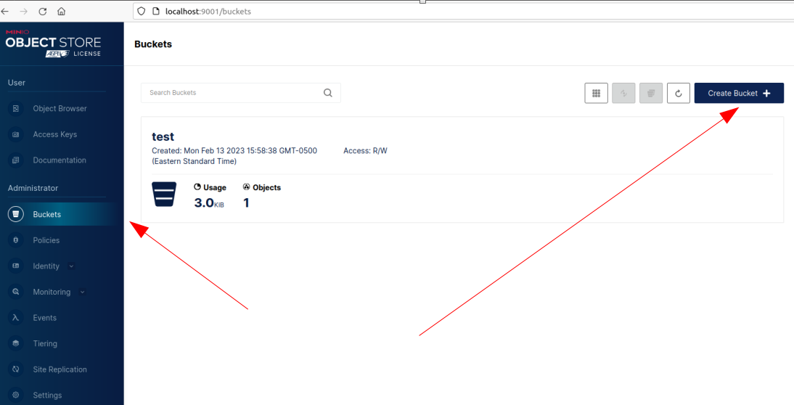
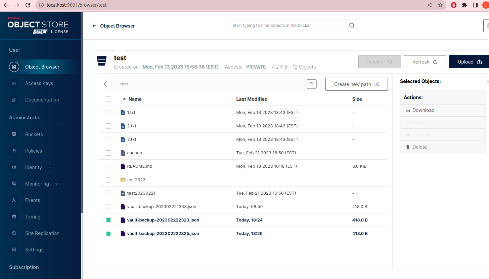

# Project Name: Backup Vault in Minio

## Project Goal
In this lab, you will deploy a helm chart with a cronjob to backup vault periodically into the Minio storage

## Table of Contents
1. [Prerequisites](#prerequisites)
2. [Project Steps](#project_steps)
3. [Post Project](#post_project)
4. [Troubleshooting](#troubleshooting)
5. [Reference](#reference)

## <a name="prerequisites">Prerequisites</a>
- Ubuntu 20.04 OS (Minimum 2 core CPU/8GB RAM/30GB Disk)
- Docker(see installation guide [here](https://docs.docker.com/get-docker/))
- Docker Compose(see installation guide [here](https://docs.docker.com/compose/install/))
- Minikube (see installation guide [here](https://minikube.sigs.k8s.io/docs/start/))
- Helm (see installation guide [here](https://helm.sh/docs/intro/install/)


## <a name="project_steps">Project Steps</a>

### 1. Start Minikube
You can install the **Minikube** by following the instruction in the [Minikube official website](https://minikube.sigs.k8s.io/docs/start/). Once it is installed, start the minikube by running below command:
```
minikube start
minikube status
```
Once the Minikube starts, you can download the **kubectl** from [k8s official website](https://kubernetes.io/docs/tasks/tools/)
```
minikube kubectl
alias k="kubectl"
```
Then, when you run the command `kubectl get node` or `k get node`, you should see below output:
```
NAME       STATUS   ROLES           AGE     VERSION
minikube   Ready    control-plane   4m37s   v1.25.3
```
Update the minio username and password in `vault-backup-values.yaml`
```
MINIO_USERNAME=$(kubectl get secret -l app=minio -o=jsonpath="{.items[0].data.rootUser}"|base64 -d)
echo "MINIO_USERNAME is $MINIO_USERNAME"
MINIO_PASSWORD=$(kubectl get secret -l app=minio -o=jsonpath="{.items[0].data.rootPassword}"|base64 -d)
echo "MINIO_PASSWORD is $MINIO_PASSWORD"
```


### 2. Enable Minikube Dashboard
You can also enable your **Minikube dashboard** by running below command:
```
minikube dashboard
```
You should see a Kuberentes Dashboard page pop out in your browser immediately. You can explore all Minikube resources in this UI website.

### 3. Install Helm v3.x
Run the following commands to install **Helm v3.x**:
> ref: https://helm.sh/docs/intro/install/
```
curl https://raw.githubusercontent.com/kubernetes/helm/master/scripts/get-helm-3 > get_helm.sh
chmod 700 get_helm.sh
./get_helm.sh
```

### 4. Add Helm Repo
Once Helm is set up properly, **add** the **repo** as follows:
```
helm repo add minio https://charts.min.io/
```

### 5. Create a namespace
Create a `minio` namespace
```
kubectl create ns minio
```

### 6. Install Minio Helm Chart
Since we are using Minikube cluster which has only 1 node, we just deploy the Minio in a test mode.
```
helm install --set resources.requests.memory=512Mi --set replicas=1 --set mode=standalone --set rootUser=rootuser,rootPassword=Test1234! --generate-name minio/minio
```
Check the minio service name and update in the `vault-backup-values.yaml` in `MINIO_ADDR` env var
```
MINIO_SERVICE_NAME=$(kubectl get svc -n minio -o=jsonpath={.items[0].metadata.name})
echo Minio service name is $MINIO_SERVICE_NAME
```

### 7. Create a Bucket in the Minio Console
In order to access the Minio console, you need to port forward it to your local
```
kubectl port-forward svc/$(kubectl get svc|grep console|awk '{print $1}') 9001:9001
```
Open your browser and go to this URL [http://localhost:9001](http://localhost:9001), and login with the username/password as `rootUser`/`rootPassword` setup above. Go to *Buckets* section in the left lane and click *Create Bucket* with a name `test`, with all other setting as default.


### 8. Install Vault Helm Chart
We are going to deploy a Vault helm chart in the Minikube cluster. Create a `vault-values.yaml` first:
```
cat <<EOF > vault-values.yaml

injector:
  enabled: "-"
  replicas: 1
  image:
    repository: "hashicorp/vault-k8s"
    tag: "1.1.0"

server:
  enabled: "-"
  image:
    repository: "hashicorp/vault"
    tag: "1.12.1"
EOF
```
Run below commands to apply the helm chart:

```
helm repo add hashicorp https://helm.releases.hashicorp.com
kubectl create ns vault-test
helm -n vault-test install vault hashicorp/vault -f vault-values.yaml
```
Initiate the Vault
```
kubectl -n vault-test exec vault-0 -- vault operator init
kubectl -n vault-test exec vault-0 -- vault operator unseal <unseal key from .vault.key>
kubectl -n vault-test exec vault-0 -- vault operator unseal <unseal key from .vault.key>
kubectl -n vault-test exec vault-0 -- vault operator unseal <unseal key from .vault.key>

# Enable secrets engine and import config
kubectl -n vault-test exec vault-0 -- vault login <root token>
kubectl -n vault-test exec vault-0 -- vault secrets enable -version=2 kv-v2 
kubectl -n vault-test exec vault-0 -- vault kv put -mount=kv-v2 devops-secret username=root password=changeme

# Enable approle engine and create role/secret
kubectl -n vault-test exec -it vault-0 -- sh

cd /tmp
cat > policy.hcl  <<EOF
path "kv-v2/*" {
  capabilities = ["create", "update","read"]
}
EOF
vault policy write first-policy policy.hcl
vault policy list
vault policy read first-policy

vault auth enable approle
vault write auth/approle/role/first-role \
    secret_id_ttl=10000m \
    token_num_uses=10 \
    token_ttl=20000m \
    token_max_ttl=30000m \
    secret_id_num_uses=40 \
    token_policies=first-policy
export ROLE_ID="$(vault read -field=role_id auth/approle/role/first-role/role-id)"
echo Role_ID is $ROLE_ID
export SECRET_ID="$(vault write -f -field=secret_id auth/approle/role/first-role/secret-id)"
echo SECRET_ID is $SECRET_ID
```

### 9. Deploy Vault Backup Helm Chart
```
kubectl -n vault-test create configmap upload --from-file=upload.sh
helm -n vault-test upgrade --install vault-backup helm-chart -f vault-backup-values.yaml
kubectl -n vault-test create job vault-backup-test --from=cronjob/vault-backup-cronjob
```

### 10. Verification
Port forward Minio console to your local host:
```
MINIO_CONSOLE_ADDR=$(kubectl -n minio get svc|grep console|awk '{print $1}')
kubectl -n minio port-forward svc/$MINIO_CONSOLE_ADDR 9001:9001
```
Login to the Minio console [http://localhost:9001](http://localhost:9001) and go to **Object Browser** section in the left navigation lane. Click **Test** bucket and you should see the backup files list there.



## <a name="post_project">Post Project</a>
Stop Minikube
```
minikube stop
```

## <a name="troubleshooting">Troubleshooting</a>

## <a name="reference">Reference</a>
[Minio Helm Deployment](https://github.com/minio/minio/tree/master/helm/minio)
