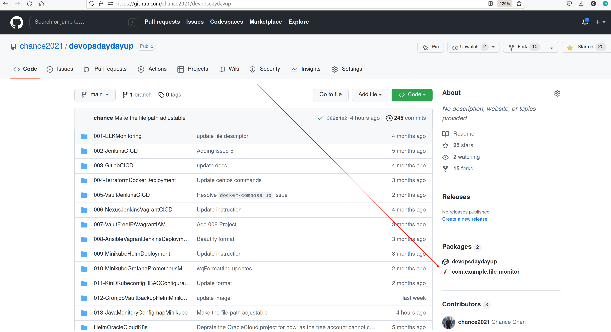

# Project Name: Develop a Java Application in K8s for Monitoring ConfigMap Modifications and Content Changes


## Project Goal: 
In this lab, you will learn how to develop a **Java application** that interacts with the Kubernetes API to **monitor changes** to a file that is mounted by a **ConfigMap**. 

It is important to note that **the file mounted by the ConfigMap is mounted as a symbolic link** (e.g. `/config/game.properties` -> `/config/..data/game.properties`-> `/config/..2023_03_02_15_51_59.1603915861/game.properties`), so your Java code should read the **symlink** instead of the file directly.
## Table of Contents
1. [Prerequisites](#prerequisites)
2. [Project Steps](#project_steps)
3. [Post Project](#post_project)
4. [Troubleshooting](#troubleshooting)
5. [Reference](#reference)

## <a name="prerequisites">Prerequisites</a>
- Ubuntu 20.04 OS (Minimum 2 core CPU/8GB RAM/30GB Disk)
- Docker(see installation guide [here](https://docs.docker.com/get-docker/))
- Docker Compose(see installation guide [here](https://docs.docker.com/compose/install/))
- Minikube (see installation guide [here](https://minikube.sigs.k8s.io/docs/start/))

## <a name="project_steps">Project Steps</a>

### 1. Start Minikube
You can install the **Minikube** by following the instruction in the [Minikube official website](https://minikube.sigs.k8s.io/docs/start/). Once it is installed, start the minikube by running below command:
```
minikube start
minikube status
```
Once the Minikube starts, you can download the **kubectl** from [k8s official website](https://kubernetes.io/docs/tasks/tools/)
```
minikube kubectl
alias k="kubectl"
```
Then, when you run the command `kubectl get node` or `k get node`, you should see below output:
```
NAME       STATUS   ROLES           AGE     VERSION
minikube   Ready    control-plane   4m37s   v1.25.3
```
Update the minio username and password in `vault-backup-values.yaml`
```
MINIO_USERNAME=$(kubectl get secret -l app=minio -o=jsonpath="{.items[0].data.rootUser}"|base64 -d)
echo "MINIO_USERNAME is $MINIO_USERNAME"
MINIO_PASSWORD=$(kubectl get secret -l app=minio -o=jsonpath="{.items[0].data.rootPassword}"|base64 -d)
echo "MINIO_PASSWORD is $MINIO_PASSWORD"
```

### 2. Build Image
Run below command to **build** the image:
```
git clone https://github.com/chance2021/devopsdaydayup.git
cd 013-JavaMonitoryConfigmapMinikube
eval $(minikube docker-env)
docker build -t java-monitor-file:v2.0 .
```
### 2. Deploy ConfigMap
```
kubectl apply -f configmap.yaml
```

### 3. Deploy Pod
```
kubectl apply -f pod.yaml
```

### 4. Verification
You can modify the contents of the ConfigMap and verify if the activity is captured in the log. First **stream the log**:
```
kubectl logs -f configmap-demo-pod
```
Then open another terminal to **modify the ConfigMap**
```
kubectl edit cm game-demo
```
**Update** anything within below **data** section
```
# From
data:
  game.properties: "enemy.types=aliens,monsters\nplayer.maximum-lives=5\\n"

# To
data:
  game.properties: "enemy.types=alienstest,monsters\nplayer.maximum-lives=5\\n"
```
Then wait for about 1 min and you should see below message in the log
```
$ kubectl logs -f configmap-demo-pod

Content has changed!
```
> Note: You can also update `spec.containers.args` in `pod.yaml` if you would like to monitor another file path.

## <a name="post_project">Post Project</a>
Stop Minikube
```
minikube stop
```

## <a name="troubleshooting">Troubleshooting</a>
### Issue 1: How to Dockerize a Java Application
Run a Docker container and install java/mvn package:
```
docker pull ubuntu
docker run -it --name ubuntu-java-build ubuntu bash

# Install Java
wget https://download.java.net/java/GA/jdk13.0.1/cec27d702aa74d5a8630c65ae61e4305/9/GPL/openjdk-13.0.1_linux-x64_bin.tar.gz
tar -xvf openjdk-13.0.1_linux-x64_bin.tar.gz
mv jdk-13.0.1 /opt/
JAVA_HOME='/opt/jdk-13.0.1'
PATH="$JAVA_HOME/bin:$PATH"
export PATH
java -version

# Install mvn
wget https://mirrors.estointernet.in/apache/maven/maven-3/3.6.3/binaries/apache-maven-3.6.3-bin.tar.gz
tar -xvf apache-maven-3.6.3-bin.tar.gz
mv apache-maven-3.6.3 /opt/
M2_HOME='/opt/apache-maven-3.6.3'
PATH="$M2_HOME/bin:$PATH"
export PATH
mvn -version

# Open another terminal and copy `src/main/java/FileMonitor.java` and `pom.xml` into the container
docker cp src/main/java/FileMonitor.java ubuntu-java-build:/
docker cp pom.xml ubuntu-java-build:/

# Go back to the container and run below command to compile the java code
mvn clean package

# You should be able to see a file called `file-monitor-1.0.0.jar` under `target` folder`. You can copy it into your host
exit
docker cp ubuntu-java-build:/target/file-monitor-1.0.0.jar .
```
ref: https://www.digitalocean.com/community/tutorials/install-maven-linux-ubuntu

### Issue 2: Install app in mvn container
**Solution**:
Please use below command to install any app you want
```
microdnf install <app_name>
```

### Issue 3: Upload the jar into Github Package repo
Add below section in `pom.xml` (Note: make sure to replace `YOUR_GITHUB_USERNAME` and `YOUR_GITHUB_REPO` accordingly):
```
    <distributionManagement>
        <repository>
            <id>github</id>
            <name>GitHub Packages</name>
            <url>https://maven.pkg.github.com/[YOUR_GITHUB_USERNAME]/[YOUR_GITHUB_REPO]</url>
        </repository>
    </distributionManagement>
```
Then create `.m2` folder under your home folder, if it doesn't exist
```
mkdir ~/.m2/
```
Create `settings.xml` with below content (Note: make sure to replace `YOUR_GITHUB_USERNAME` and `YOUR_GITHUB_TOKEN` accordingly):
```
<settings>
    <servers>
        <server>
        <id>github</id>
            <username>[YOUR_GITHUB_USERNAME]</username>
            <password>[YOUR_GITHUB_TOKEN]</password>
        </server>
    </servers>
</settings>
```
Then run below command to upload the artifacts to Github Package repo:
```
mvn --batch-mode deploy
```
You should see output like this:
```
[INFO] Downloading from github: https://maven.pkg.github.com/chance2021/devopsdaydayup/com/example/file-monitor/maven-metadata.xml
[INFO] Downloaded from github: https://maven.pkg.github.com/chance2021/devopsdaydayup/com/example/file-monitor/maven-metadata.xml (221 B at 505 B/s)
[INFO] Uploading to github: https://maven.pkg.github.com/chance2021/devopsdaydayup/com/example/file-monitor/maven-metadata.xml
[INFO] Uploaded to github: https://maven.pkg.github.com/chance2021/devopsdaydayup/com/example/file-monitor/maven-metadata.xml (330 B at 990 B/s)
[INFO] ------------------------------------------------------------------------
[INFO] BUILD SUCCESS
[INFO] ------------------------------------------------------------------------
[INFO] Total time:  15.020 s
[INFO] Finished at: 2023-03-02T20:56:50Z
```
The package will appear in the Github page after the upload successfully.

You can download the artifact by below commands:
```
wget --header "Authorization: token <GITHUB_TOKEN>" https://maven.pkg.github.com/chance2021/devopsdaydayup/com/example/file-monitor/1.0.0/file-monitor-1.0.0.jar
```

ref: https://docs.github.com/en/actions/publishing-packages/publishing-java-packages-with-maven

## <a name="reference">Reference</a>
- [ConfigMap](https://kubernetes.io/docs/concepts/configuration/configmap/)
- [AliCloud Build an Image for a Java app via Dockerfile](https://static-aliyun-doc.oss-cn-hangzhou.aliyuncs.com/download%2Fpdf%2F60719%2FBest_Practices_reseller_en-US.pdf)
- [Pushing directly to the in-cluster Docker daemon (docker-env)](https://minikube.sigs.k8s.io/docs/handbook/pushing/#1-pushing-directly-to-the-in-cluster-docker-daemon-docker-env)
