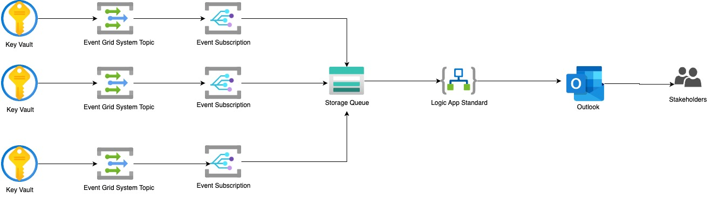

# Azure Key Vault Secret Expiry Solution
今天这篇文章是Azure学习系列的特别篇，内容是结合我过去一个月在工作中经历的一个真实案例来和大家分享一些心得体会。 

这次案例的任务目标是**解决Azure Key Vault里的Secret过期的提醒问题**，要求必须使用Terraform自动化流程。以下是整个技术实现的架构图：

总的来说，我们这个案例通过Event Grid来监控Key Vault里密钥的过期事件，一旦有相关事件发生，就发送Message到Storage Queue里，然后通过Logic App触发一个给相关的人员发送邮件的流程，达到事件提醒的目的。 

接下来我们来介绍一下这次案例里使用到的所有技术。

- Resource Group
- Key Vault
- Event Grid (Event Grid System Topic/Event Subscription)
- Storage Account (Storage Queue)
- Logic App Standard
- Private Endpoint

## Resource Group
Resource Group简单说就是Azure里存放一组资源(Resources)的容器，就好像是存放文件的文件夹，一般我们会把一组有关联的资源放到同一个Resource Group里便于管理。还有一些特性可以参考我们之前的文章[Resource Group](https://github.com/chance2021/devopsdaydayup/blob/main/cloud/azure/20230718-ARM-ResourceManagement.md#resource-management).

## Key Vault
这是Azure的密钥管理服务，主要是用来存放密码证书这类内容敏感的信息。一般它不对公网开放，只能内部网络访问。使用它的应用程序在得到认证之后，可以通过它来存储或读取相应密钥信息。换句话说，应用本身不需要存储这些敏感信息，它只要知道这些信息在Key Vault具体哪个位置，然后在需要使用的时候随时去调取就好。这样的话哪怕应用代码泄露，那这些密钥信息也不会被跟着一起泄露了。

## Event Grid
Azure Event Grid是用来对某些指定的事件进行监控然后再触发一些特定的操作。我们的案例里是使用Event Grid来监控Key Vault产生的SecretExpire这个事件，一旦有事件产生，就可以发送Message到Storage Queue里，供消息订阅者消费。

## Storage Account
Storage Account是Azure的一种存储服务，它可以存储半结构性数据，比如table，也可以存储非结构性数据，比如视频，图片，文件等等。在我们的实验中，主要是用来存储消息队列queue的。也就是接收来自于Event Grid的Message，然后被Logic App消费。

## App Service Plan
App Service Plan是为Web App (e.g. App Service, Function App, Logic App)定义了计算资源，其中包括什么操作系统（e.g. Windows, Linux), Region（e.g. Canada Central, Canada East), VM数量，VM大小(e.g. Small, Medium, Large), 价格等级(e.g. Free, Shared, Basic, Standard, Premium, etc..). 更多信息请参考我们之前的文章[App Service Plan](https://github.com/chance2021/devopsdaydayup/blob/main/cloud/azure/20230729-Compute-AppServicePlan.md)。

## Logic App Standard
Logic App你可以简单的理解为通过UI来构建代码的服务。在Logic App里集成了很多服务，比如我们这个案例用到的监控Storage Queue服务。这个服务会定时查看Storage Queue里是否有Message，一旦发现Message，立马发送Email给相关人员。这个功能你可以用代码来完成(比如Function App)，但是如果你不熟悉代码，你就可以通过Logic App里拖拖拽拽来完成一个应用的构建。这个到时候我们班会上现场演示一下大家就会很容易明白了。其他关于Logic App的信息可以参考我们的另一篇文章[Logic App](https://github.com/chance2021/devopsdaydayup/blob/main/cloud/azure/20230821-Compute-AzureLogicApp.md)

## Private Endpoint
Private Endpoint是Azure 提供的一个Network相关功能，它能让Azure里部署的服务之间不通过公共网络，而是通过Private Network来通信，这样就能大大降低网络安全风险。之所以单独把这个技术提出来说，是因为我们这个案例原本是打算让Event Grid直接和Logic App直接连接的，但是可惜目前的Event Grid [System Topic不支持Private Endpoint](https://learn.microsoft.com/en-us/azure/event-grid/system-topics)，所以我们必须多一个步骤，在中间使用Storage Queue来连接Event Grid和Logic App。这个坑我花了一周多才填上，和Microsoft Team反复测试后才最终确认了，很坑，大家需要注意。